# Pre-Sales Documentation - Navigation Diagram

## High-Level Architecture

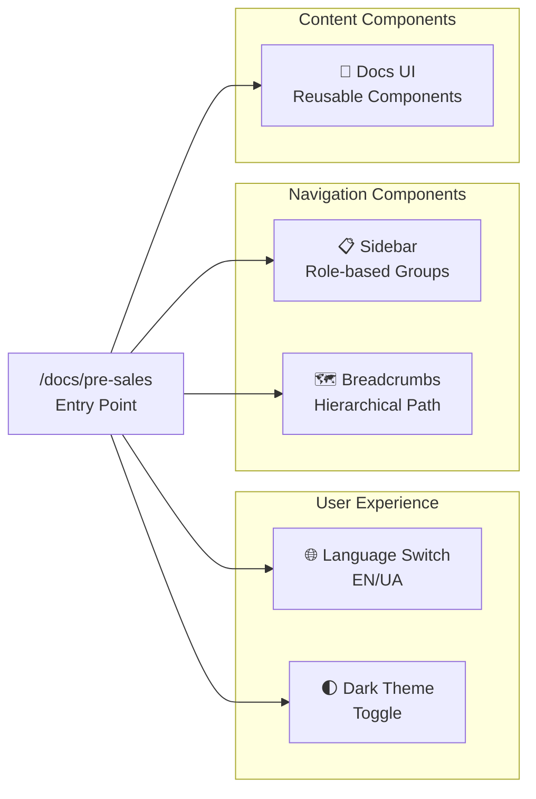

## Complete Navigation Flow

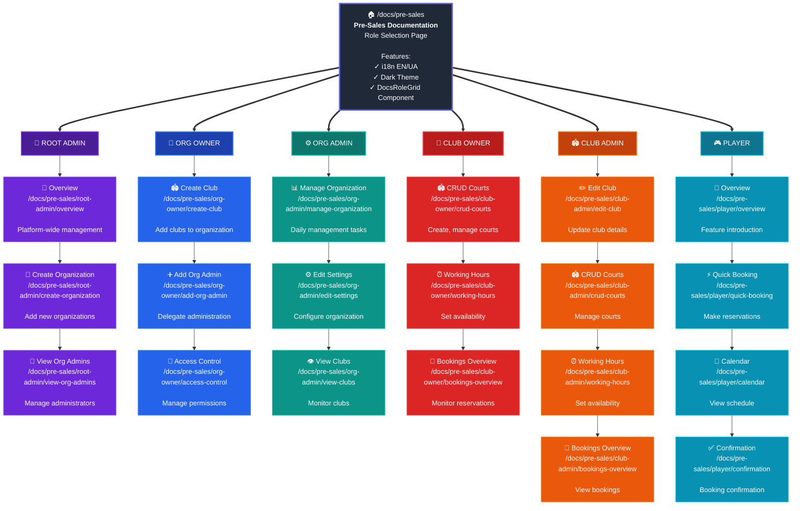

## Sidebar Structure Diagram

```mermaid
graph TB
    Sidebar["📚 Pre-Sales Documentation Sidebar<br/>(DocsSidebar Component)"]
    
    subgraph Group1 ["🎮 Player Group"]
        P_1["Overview"]
        P_2["Quick Booking"]
        P_3["Calendar"]
        P_4["Confirmation"]
    end
    
    subgraph Group2 ["👑 Root Admin Group"]
        RA_1["Overview"]
        RA_2["Create Organization"]
        RA_3["View Org Admins"]
    end
    
    subgraph Group3 ["🏢 Org Owner Group"]
        OO_1["Create Club"]
        OO_2["Add Org Admin"]
        OO_3["Access Control"]
    end
    
    subgraph Group4 ["⚙️ Org Admin Group"]
        OA_1["Manage Organization"]
        OA_2["Edit Settings"]
        OA_3["View Clubs"]
    end
    
    subgraph Group5 ["🎾 Club Owner Group"]
        CO_1["CRUD Courts"]
        CO_2["Working Hours"]
        CO_3["Bookings Overview"]
    end
    
    subgraph Group6 ["🏟️ Club Admin Group"]
        CA_1["Edit Club"]
        CA_2["CRUD Courts"]
        CA_3["Working Hours"]
        CA_4["Bookings Overview"]
    end
    
    Sidebar --> Group1
    Sidebar --> Group2
    Sidebar --> Group3
    Sidebar --> Group4
    Sidebar --> Group5
    Sidebar --> Group6
    
    Group1 --> P_1
    Group1 --> P_2
    Group1 --> P_3
    Group1 --> P_4
    
    Group2 --> RA_1
    Group2 --> RA_2
    Group2 --> RA_3
    
    Group3 --> OO_1
    Group3 --> OO_2
    Group3 --> OO_3
    
    Group4 --> OA_1
    Group4 --> OA_2
    Group4 --> OA_3
    
    Group5 --> CO_1
    Group5 --> CO_2
    Group5 --> CO_3
    
    Group6 --> CA_1
    Group6 --> CA_2
    Group6 --> CA_3
    Group6 --> CA_4
    
    classDef sidebarClass fill:#1f2937,stroke:#6366f1,color:#fff
    classDef groupClass fill:#374151,stroke:#6366f1,color:#fff
    classDef itemClass fill:#4b5563,stroke:#9ca3af,color:#fff
    
    class Sidebar sidebarClass
    class Group1,Group2,Group3,Group4,Group5,Group6 groupClass
    class P_1,P_2,P_3,P_4,RA_1,RA_2,RA_3,OO_1,OO_2,OO_3,OA_1,OA_2,OA_3,CO_1,CO_2,CO_3,CA_1,CA_2,CA_3,CA_4 itemClass
```

## Breadcrumbs Navigation Flow

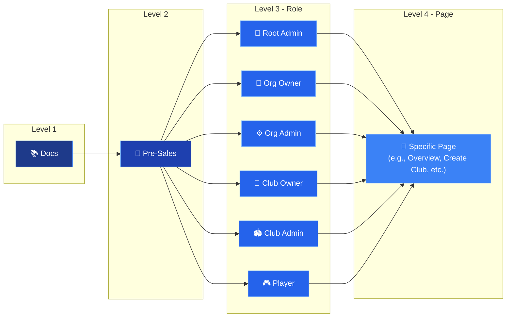

## Component Architecture

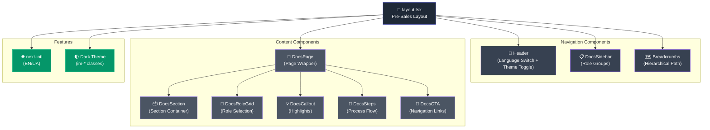

## User Journey Examples

### Example 1: Root Admin Journey
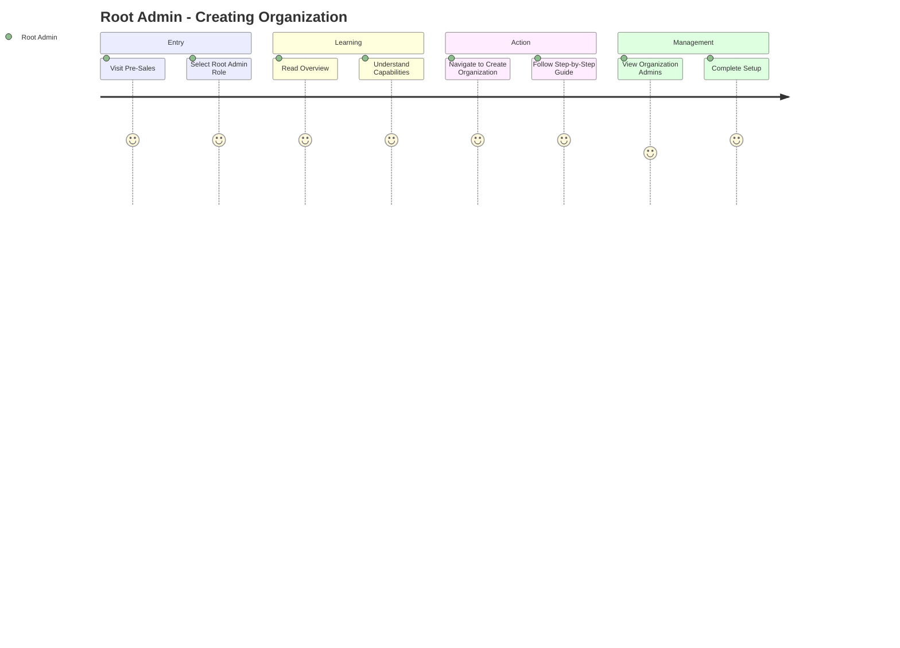

### Example 2: Player Journey
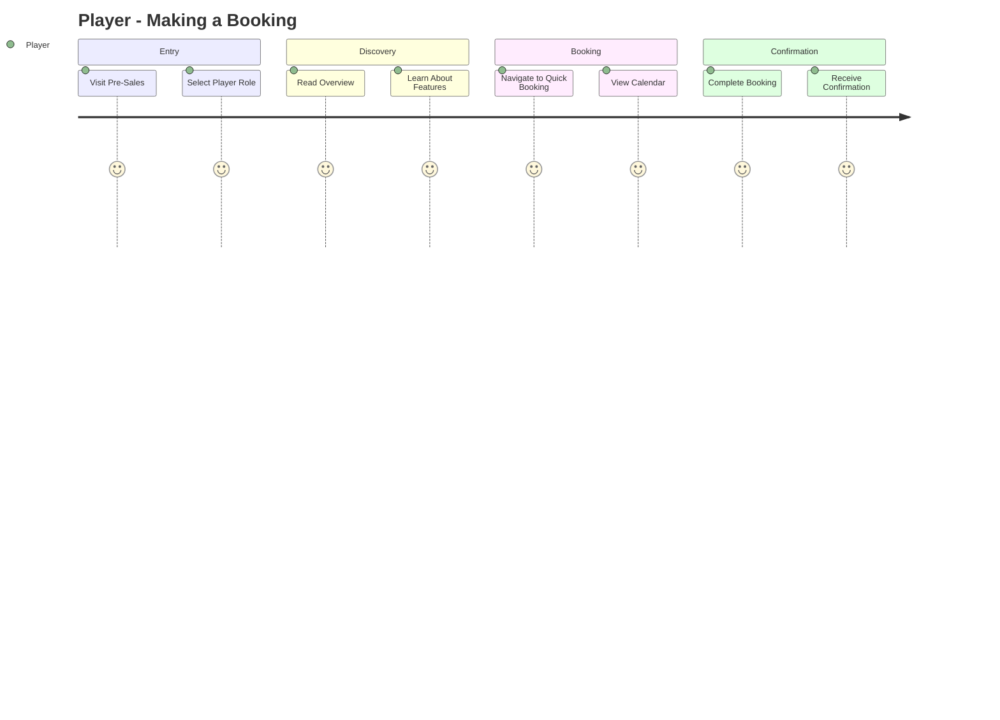

### Example 3: Club Owner Journey
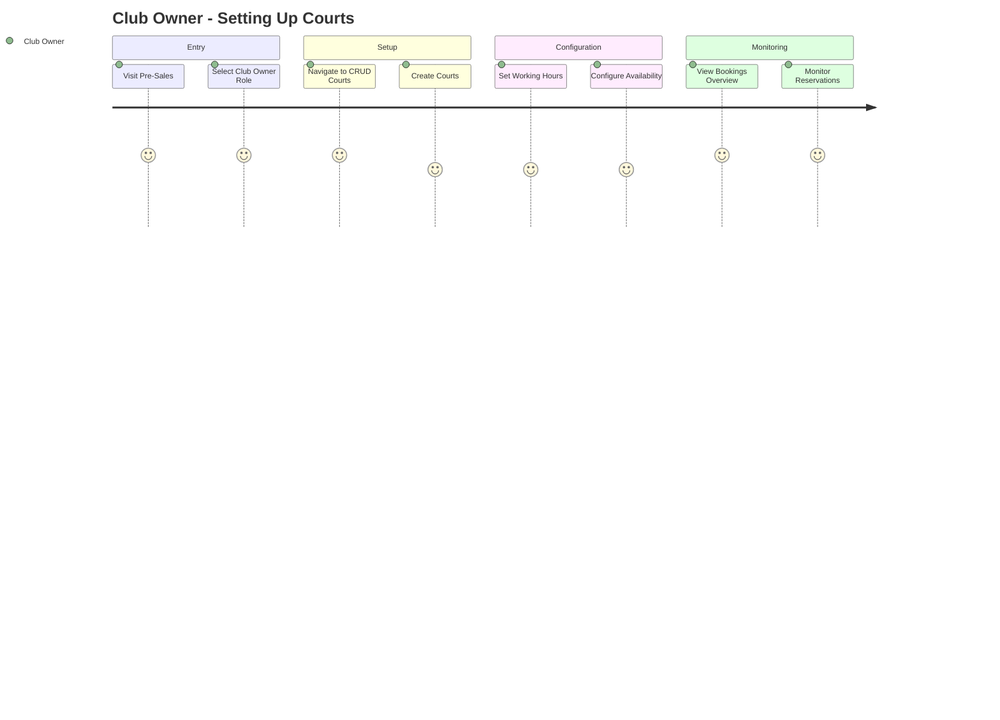

## State Diagram - Navigation States

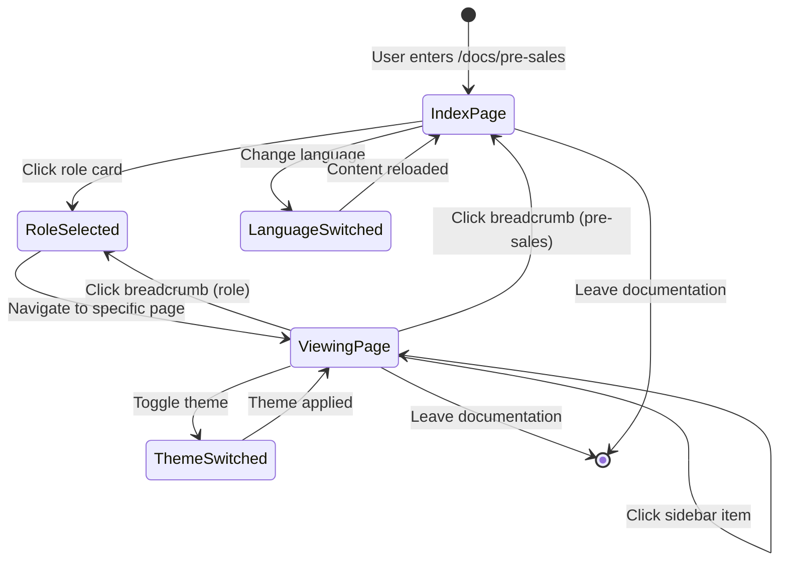

## Technology Stack

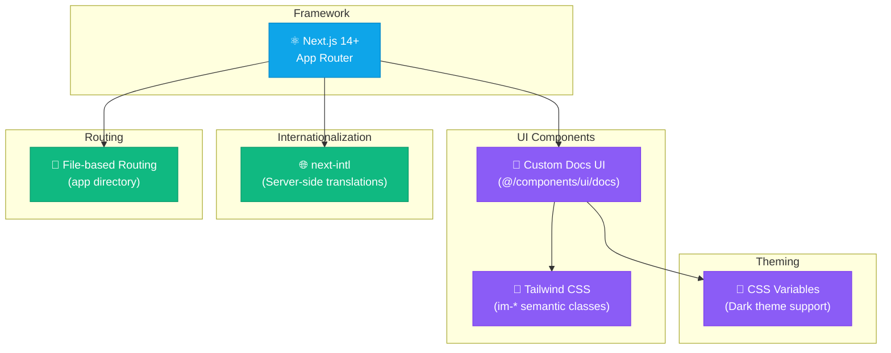

## Quick Reference: Role Pages Count

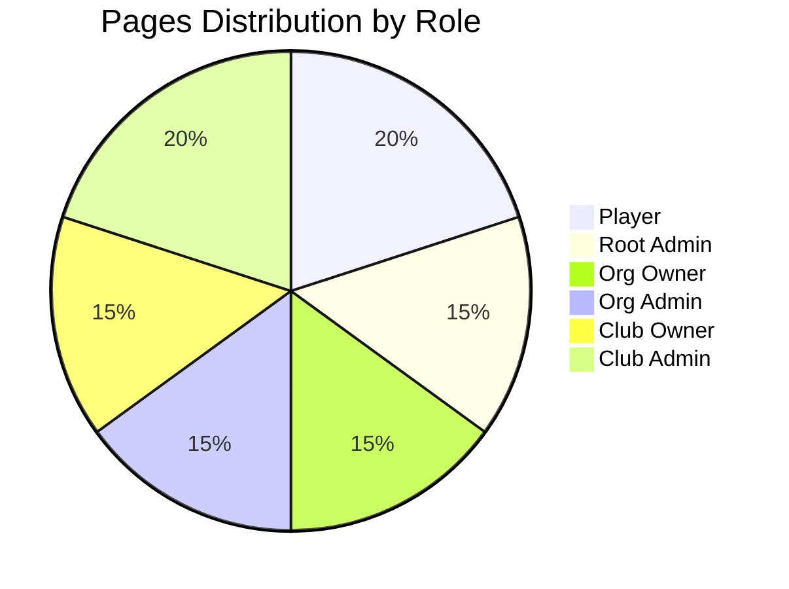

## Implementation Status

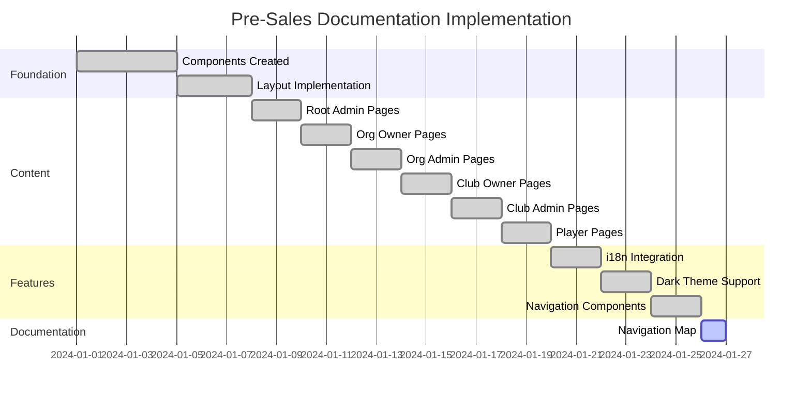

---

## Legend

### Icons Used
- 🏠 Home/Entry
- 📚 Documentation
- 👑 Root Admin
- 🏢 Organization Owner
- ⚙️ Organization Admin
- 🎾 Club Owner
- 🏟️ Club Admin
- 🎮 Player
- 📄 Page
- 📋 Sidebar
- 🗺️ Breadcrumbs
- 🌐 Internationalization
- 🌓 Dark Theme
- 🎨 UI Components
- ⚛️ React/Next.js

### Color Coding
- **Purple** (#4a1d96) - Root Admin
- **Blue** (#1e40af) - Organization Owner
- **Teal** (#0f766e) - Organization Admin
- **Red** (#b91c1c) - Club Owner
- **Orange** (#c2410c) - Club Admin
- **Cyan** (#0e7490) - Player
- **Gray** (#1f2937) - Entry/General

---

## Notes

1. All diagrams are created using Mermaid syntax for easy rendering in GitHub and documentation tools
2. Color schemes match the application's dark theme palette
3. Flow follows logical progression from entry to specific role pages
4. Each role has a distinct color for easy visual identification
5. Diagrams are scalable and can be embedded in presentations or documentation
