# Pre-Sales Documentation Navigation Map

## Overview

This document provides a comprehensive visual and structured navigation map for the pre-sales documentation in the ArenaOne Next.js application. It shows how users navigate through different roles, key flows, and documentation steps.

## Quick Reference

- **Base URL**: `/docs/pre-sales`
- **Total Roles**: 6 (Root Admin, Org Owner, Org Admin, Club Owner, Club Admin, Player)
- **Total Pages**: 22 (including index)
- **i18n Support**: ✅ EN/UA language switching via next-intl
- **Dark Theme**: ✅ Supported with `im-*` semantic classes
- **UI Components**: ✅ Reuses DocsPage, DocsSection, DocsRoleGrid, DocsSidebar, Breadcrumbs

---

## Navigation Flow Diagram

```mermaid
graph TB
    Start["/docs/pre-sales<br/>📚 Pre-Sales Documentation<br/>Role Selection Page"]
    
    %% Root Admin Branch
    RootAdmin["👑 Root Admin<br/>/docs/pre-sales/root-admin"]
    RA1["/docs/pre-sales/root-admin/overview<br/>Overview"]
    RA2["/docs/pre-sales/root-admin/create-organization<br/>Create Organization"]
    RA3["/docs/pre-sales/root-admin/view-org-admins<br/>View Org Admins"]
    
    %% Org Owner Branch
    OrgOwner["🏢 Org Owner<br/>/docs/pre-sales/org-owner"]
    OO1["/docs/pre-sales/org-owner/create-club<br/>Create Club"]
    OO2["/docs/pre-sales/org-owner/add-org-admin<br/>Add Org Admin"]
    OO3["/docs/pre-sales/org-owner/access-control<br/>Access Control"]
    
    %% Org Admin Branch
    OrgAdmin["⚙️ Org Admin<br/>/docs/pre-sales/org-admin"]
    OA1["/docs/pre-sales/org-admin/manage-organization<br/>Manage Organization"]
    OA2["/docs/pre-sales/org-admin/edit-settings<br/>Edit Settings"]
    OA3["/docs/pre-sales/org-admin/view-clubs<br/>View Clubs"]
    
    %% Club Owner Branch
    ClubOwner["🎾 Club Owner<br/>/docs/pre-sales/club-owner"]
    CO1["/docs/pre-sales/club-owner/crud-courts<br/>CRUD Courts"]
    CO2["/docs/pre-sales/club-owner/working-hours<br/>Working Hours"]
    CO3["/docs/pre-sales/club-owner/bookings-overview<br/>Bookings Overview"]
    
    %% Club Admin Branch
    ClubAdmin["🏟️ Club Admin<br/>/docs/pre-sales/club-admin"]
    CA1["/docs/pre-sales/club-admin/edit-club<br/>Edit Club"]
    CA2["/docs/pre-sales/club-admin/crud-courts<br/>CRUD Courts"]
    CA3["/docs/pre-sales/club-admin/working-hours<br/>Working Hours"]
    CA4["/docs/pre-sales/club-admin/bookings-overview<br/>Bookings Overview"]
    
    %% Player Branch
    Player["🎮 Player<br/>/docs/pre-sales/player"]
    P1["/docs/pre-sales/player/overview<br/>Overview"]
    P2["/docs/pre-sales/player/quick-booking<br/>Quick Booking"]
    P3["/docs/pre-sales/player/calendar<br/>Calendar"]
    P4["/docs/pre-sales/player/confirmation<br/>Confirmation"]
    
    %% Connections
    Start --> RootAdmin
    Start --> OrgOwner
    Start --> OrgAdmin
    Start --> ClubOwner
    Start --> ClubAdmin
    Start --> Player
    
    RootAdmin --> RA1
    RootAdmin --> RA2
    RootAdmin --> RA3
    
    OrgOwner --> OO1
    OrgOwner --> OO2
    OrgOwner --> OO3
    
    OrgAdmin --> OA1
    OrgAdmin --> OA2
    OrgAdmin --> OA3
    
    ClubOwner --> CO1
    ClubOwner --> CO2
    ClubOwner --> CO3
    
    ClubAdmin --> CA1
    ClubAdmin --> CA2
    ClubAdmin --> CA3
    ClubAdmin --> CA4
    
    Player --> P1
    Player --> P2
    Player --> P3
    Player --> P4
    
    classDef rootStyle fill:#4a1d96,stroke:#7c3aed,color:#fff
    classDef orgOwnerStyle fill:#1e40af,stroke:#3b82f6,color:#fff
    classDef orgAdminStyle fill:#0f766e,stroke:#14b8a6,color:#fff
    classDef clubOwnerStyle fill:#b91c1c,stroke:#ef4444,color:#fff
    classDef clubAdminStyle fill:#c2410c,stroke:#f97316,color:#fff
    classDef playerStyle fill:#0e7490,stroke:#06b6d4,color:#fff
    classDef startStyle fill:#1f2937,stroke:#6366f1,color:#fff
    
    class Start startStyle
    class RootAdmin,RA1,RA2,RA3 rootStyle
    class OrgOwner,OO1,OO2,OO3 orgOwnerStyle
    class OrgAdmin,OA1,OA2,OA3 orgAdminStyle
    class ClubOwner,CO1,CO2,CO3 clubOwnerStyle
    class ClubAdmin,CA1,CA2,CA3,CA4 clubAdminStyle
    class Player,P1,P2,P3,P4 playerStyle
```



---

## Complete URL Mapping

### Entry Point
| Page | URL | Description |
|------|-----|-------------|
| Pre-Sales Index | `/docs/pre-sales` | Role selection page with overview |

### Root Admin (3 pages)
| Page | URL | Description |
|------|-----|-------------|
| Overview | `/docs/pre-sales/root-admin/overview` | Root admin role overview and capabilities |
| Create Organization | `/docs/pre-sales/root-admin/create-organization` | How to create new organizations |
| View Org Admins | `/docs/pre-sales/root-admin/view-org-admins` | Managing organization administrators |

### Organization Owner (3 pages)
| Page | URL | Description |
|------|-----|-------------|
| Create Club | `/docs/pre-sales/org-owner/create-club` | Creating clubs within organization |
| Add Org Admin | `/docs/pre-sales/org-owner/add-org-admin` | Adding organization administrators |
| Access Control | `/docs/pre-sales/org-owner/access-control` | Managing organization access rights |

### Organization Admin (3 pages)
| Page | URL | Description |
|------|-----|-------------|
| Manage Organization | `/docs/pre-sales/org-admin/manage-organization` | Organization management tasks |
| Edit Settings | `/docs/pre-sales/org-admin/edit-settings` | Editing organization settings |
| View Clubs | `/docs/pre-sales/org-admin/view-clubs` | Viewing clubs in organization |

### Club Owner (3 pages)
| Page | URL | Description |
|------|-----|-------------|
| CRUD Courts | `/docs/pre-sales/club-owner/crud-courts` | Create, read, update, delete courts |
| Working Hours | `/docs/pre-sales/club-owner/working-hours` | Setting club working hours |
| Bookings Overview | `/docs/pre-sales/club-owner/bookings-overview` | Viewing and managing bookings |

### Club Admin (4 pages)
| Page | URL | Description |
|------|-----|-------------|
| Edit Club | `/docs/pre-sales/club-admin/edit-club` | Editing club details |
| CRUD Courts | `/docs/pre-sales/club-admin/crud-courts` | Create, read, update, delete courts |
| Working Hours | `/docs/pre-sales/club-admin/working-hours` | Setting club working hours |
| Bookings Overview | `/docs/pre-sales/club-admin/bookings-overview` | Viewing and managing bookings |

### Player (4 pages)
| Page | URL | Description |
|------|-----|-------------|
| Overview | `/docs/pre-sales/player/overview` | Player role overview and features |
| Quick Booking | `/docs/pre-sales/player/quick-booking` | Making quick bookings |
| Calendar | `/docs/pre-sales/player/calendar` | Viewing booking calendar |
| Confirmation | `/docs/pre-sales/player/confirmation` | Booking confirmation process |

---

## Sidebar Navigation Structure

The sidebar is organized into 6 collapsible groups, one for each role:

```
┌─────────────────────────────────┐
│ 📚 Pre-Sales Documentation      │
├─────────────────────────────────┤
│ 🎮 Player                       │
│   • Overview                    │
│   • Quick Booking               │
│   • Calendar                    │
│   • Confirmation                │
├─────────────────────────────────┤
│ 👑 Root Admin                   │
│   • Overview                    │
│   • Create Organization         │
│   • View Org Admins             │
├─────────────────────────────────┤
│ 🏢 Org Owner                    │
│   • Create Club                 │
│   • Add Org Admin               │
│   • Access Control              │
├─────────────────────────────────┤
│ ⚙️ Org Admin                    │
│   • Manage Organization         │
│   • Edit Settings               │
│   • View Clubs                  │
├─────────────────────────────────┤
│ 🎾 Club Owner                   │
│   • CRUD Courts                 │
│   • Working Hours               │
│   • Bookings Overview           │
├─────────────────────────────────┤
│ 🏟️ Club Admin                   │
│   • Edit Club                   │
│   • CRUD Courts                 │
│   • Working Hours               │
│   • Bookings Overview           │
└─────────────────────────────────┘
```

**Implementation:** `src/app/(pages)/docs/pre-sales/layout.tsx`
- Uses `DocsSidebar` component
- Groups defined in `sidebarGroups` array
- Current path highlighting via `currentPath` prop

---

## Breadcrumbs Navigation Logic

Breadcrumbs are dynamically generated based on the current URL path:

### Structure
```
Docs / Pre-Sales / [Role] / [Page]
```

### Examples

1. **Index page:**
   ```
   Docs / Pre-Sales
   ```

2. **Role overview:**
   ```
   Docs / Pre-Sales / Root Admin
   ```

3. **Specific page:**
   ```
   Docs / Pre-Sales / Root Admin / Create Organization
   ```

### Implementation Logic

**File:** `src/app/(pages)/docs/pre-sales/layout.tsx`

```typescript
// Extract role from URL
const roleMatch = pathname.match(/\/docs\/pre-sales\/([^/]+)/);
const currentRole = roleMatch ? roleMatch[1] : null;

// Build breadcrumbs array
breadcrumbs.push({ label: t("breadcrumbs.docs"), href: "/docs/for-clubs" });
breadcrumbs.push({ label: t("breadcrumbs.preSales"), href: "/docs/pre-sales" });

if (currentRole) {
  // Add role breadcrumb
  breadcrumbs.push({
    label: t(`breadcrumbs.${roleKey}`),
    href: `/docs/pre-sales/${currentRole}`,
  });
  
  // Add page-specific breadcrumb if on specific page
  const pageMatch = pathname.match(/\/docs\/pre-sales\/[^/]+\/([^/]+)/);
  if (pageMatch) {
    breadcrumbs.push({ label: t(`${roleKey}.${pageMatch[1]}`) });
  }
}
```

**Component:** `Breadcrumbs` from `@/components/ui/Breadcrumbs`
- Separator: `/`
- Clickable navigation on all items except last
- Dark theme compatible

---

## Internationalization (i18n) Support

### Language Support
- ✅ **English (EN)** - Default
- ✅ **Ukrainian (UA)** - Full translation support

### Translation Keys Structure

**File:** `locales/[locale]/docs.json`

```json
{
  "docs": {
    "preSales": {
      "index": {
        "metaTitle": "Pre-Sales Documentation",
        "title": "Pre-Sales Documentation",
        "roles": {
          "rootAdmin": { "name": "Root Admin", "description": "..." },
          "orgOwner": { "name": "Organization Owner", "description": "..." },
          "orgAdmin": { "name": "Organization Admin", "description": "..." },
          "clubOwner": { "name": "Club Owner", "description": "..." },
          "clubAdmin": { "name": "Club Admin", "description": "..." },
          "player": { "name": "Player", "description": "..." }
        }
      },
      "sidebar": {
        "breadcrumbs": {
          "docs": "Docs",
          "preSales": "Pre-Sales",
          "rootadmin": "Root Admin",
          "orgowner": "Org Owner",
          "orgadmin": "Org Admin",
          "clubowner": "Club Owner",
          "clubadmin": "Club Admin",
          "player": "Player"
        },
        "rootadmin": {
          "overview": "Overview",
          "create-organization": "Create Organization",
          "view-org-admins": "View Org Admins"
        }
        // ... more role-specific translations
      }
    }
  }
}
```

### Language Switching
- Users can switch language using the language selector in the header
- Language preference is stored and applied globally
- All sidebar items, breadcrumbs, and content are translated
- Implementation via `next-intl` with `useTranslations()` hook

---

## Dark Theme Support

### Theme Implementation
All pre-sales documentation pages support dark theme via:

1. **CSS Variables** (`im-*` semantic classes)
   - `--im-bg-primary` - Primary background
   - `--im-bg-secondary` - Secondary background
   - `--im-text-primary` - Primary text
   - `--im-text-secondary` - Secondary text
   - `--im-border-primary` - Border colors
   - `--im-accent-primary` - Accent colors

2. **Component Classes**
   - `.im-docs-layout` - Main layout container
   - `.im-docs-sidebar-wrapper` - Sidebar container
   - `.im-docs-content` - Content area
   - `.im-docs-breadcrumbs-wrapper` - Breadcrumbs container

3. **Custom CSS File**
   - `src/app/(pages)/docs/pre-sales/layout.css`
   - Defines responsive layout and dark theme styles

### Theme Toggle
- Global theme switcher in header
- Automatically applies to all documentation
- Persisted across page navigation

---

## Reused UI Components

All documentation pages use standardized UI components from `@/components/ui/docs`:

### Core Components

| Component | Purpose | Usage |
|-----------|---------|-------|
| `DocsPage` | Page wrapper with title and layout | Wraps all documentation content |
| `DocsSection` | Section container with title | Organizes content into sections |
| `DocsSubsection` | Subsection within a section | Nested content organization |
| `DocsRoleGrid` | Grid of role cards | Role selection on index page |
| `DocsRoleCard` | Individual role card with icon | Displays role with description |
| `DocsList` | Ordered/unordered lists | Step-by-step instructions |
| `DocsCallout` | Highlighted callout boxes | Important information |
| `DocsNote` | Informational notes | Tips, warnings, success messages |
| `DocsCTA` | Call-to-action buttons | Navigation prompts |
| `DocsScreenshot` | Screenshot placeholders | Visual examples |
| `DocsFeatureList` | Feature list with icons | Key features display |
| `DocsSteps` | Numbered step progression | Process flows |
| `DocsSidebar` | Sidebar navigation | Role-based navigation menu |
| `Breadcrumbs` | Breadcrumb navigation | Hierarchical path display |

### Import Pattern
```typescript
import {
  DocsPage,
  DocsSection,
  DocsRoleGrid,
} from "@/components/ui/docs";
```

### Styling Conventions
- All components use `im-docs-*` CSS classes
- Semantic naming for maintainability
- Dark theme support built-in
- Responsive design with mobile-first approach

---

## Key Flows by Role

### Root Admin Flow
```
Overview → Create Organization → View Org Admins
```
**Use Case:** Platform-wide management, creating new organizations, managing organization administrators

### Organization Owner Flow
```
Create Club → Add Org Admin → Access Control
```
**Use Case:** Creating and managing clubs, delegating administration, controlling access

### Organization Admin Flow
```
Manage Organization → Edit Settings → View Clubs
```
**Use Case:** Day-to-day organization management, configuring settings, monitoring clubs

### Club Owner Flow
```
CRUD Courts → Working Hours → Bookings Overview
```
**Use Case:** Setting up courts, configuring availability, monitoring bookings

### Club Admin Flow
```
Edit Club → CRUD Courts → Working Hours → Bookings Overview
```
**Use Case:** Club configuration, court management, operational oversight

### Player Flow
```
Overview → Quick Booking → Calendar → Confirmation
```
**Use Case:** Discovering features, making bookings, viewing schedule, confirming reservations

---

## Access Pattern Summary

### Entry Point
All users start at `/docs/pre-sales` which displays:
- Overview of the documentation
- Role selection grid with 6 role cards
- Each card navigates to the first page of that role

### Navigation Methods
1. **Sidebar** - Always visible, organized by role groups
2. **Breadcrumbs** - Shows current location and allows upward navigation
3. **In-content links** - DocsCTA components guide to next steps
4. **Role cards** - Visual selection on index page

### Responsive Behavior
- **Desktop:** Sidebar visible, full breadcrumbs
- **Tablet:** Collapsible sidebar, full breadcrumbs
- **Mobile:** Hamburger menu, condensed breadcrumbs

---

## Technical Implementation Details

### File Structure
```
src/app/(pages)/docs/pre-sales/
├── layout.tsx              # Layout with sidebar and breadcrumbs
├── layout.css              # Custom styles for pre-sales docs
├── page.tsx                # Index/role selection page
├── root-admin/
│   ├── overview/page.tsx
│   ├── create-organization/page.tsx
│   └── view-org-admins/page.tsx
├── org-owner/
│   ├── create-club/page.tsx
│   ├── add-org-admin/page.tsx
│   └── access-control/page.tsx
├── org-admin/
│   ├── manage-organization/page.tsx
│   ├── edit-settings/page.tsx
│   └── view-clubs/page.tsx
├── club-owner/
│   ├── crud-courts/page.tsx
│   ├── working-hours/page.tsx
│   └── bookings-overview/page.tsx
├── club-admin/
│   ├── edit-club/page.tsx
│   ├── crud-courts/page.tsx
│   ├── working-hours/page.tsx
│   └── bookings-overview/page.tsx
└── player/
    ├── overview/page.tsx
    ├── quick-booking/page.tsx
    ├── calendar/page.tsx
    └── confirmation/page.tsx
```

### Metadata Generation
Each page uses `generateMetadata()` for SEO:
```typescript
export async function generateMetadata(): Promise<Metadata> {
  const t = await getTranslations("docs.preSales.index");
  return {
    title: t("metaTitle"),
    description: t("metaDescription"),
  };
}
```

### Server Components
- All pages are React Server Components
- Translations loaded server-side via `getTranslations()`
- Better performance and SEO

---

## Usage for Development Planning

### For Developers
1. **Adding new pages:**
   - Create page file in appropriate role folder
   - Add URL to sidebar configuration in `layout.tsx`
   - Add translation keys to `locales/[locale]/docs.json`
   - Use standard Docs UI components

2. **Modifying navigation:**
   - Update `sidebarGroups` array in `layout.tsx`
   - Update breadcrumb logic if needed
   - Test both EN and UA languages

3. **Styling changes:**
   - Modify `layout.css` for pre-sales-specific styles
   - Update component CSS files for global changes
   - Maintain `im-*` class conventions

### For Client Demos
1. **Show role-based access:**
   - Start at `/docs/pre-sales`
   - Click on relevant role card
   - Navigate through sidebar to show features

2. **Highlight features:**
   - i18n: Switch language in header
   - Dark theme: Toggle theme switch
   - Navigation: Use breadcrumbs to move up hierarchy
   - Content: Show DocsCallout, DocsSteps, etc.

3. **Demonstrate flows:**
   - Follow role-specific flow from top to bottom
   - Show how each step builds on previous
   - Highlight key actions in each section

---

## Statistics

| Metric | Count |
|--------|-------|
| Total Roles | 6 |
| Total Pages | 22 (including index) |
| Root Admin Pages | 3 |
| Org Owner Pages | 3 |
| Org Admin Pages | 3 |
| Club Owner Pages | 3 |
| Club Admin Pages | 4 |
| Player Pages | 4 |
| Sidebar Groups | 6 |
| UI Components Used | 14+ |
| Languages Supported | 2 (EN, UA) |

---

## Compliance with Requirements

### ✅ Diagram shows all roles and their key steps
- All 6 roles are mapped
- Each role's pages are documented
- Key flows are visualized

### ✅ Shows sidebar and breadcrumbs navigation
- Sidebar structure documented with visual representation
- Breadcrumbs logic explained with code examples
- Both components integrate seamlessly

### ✅ Each step includes URL mapping
- Complete URL table for all 22 pages
- URLs follow consistent pattern
- Easy to reference and use

### ✅ Clear enough for planning and client demo
- Mermaid diagram shows visual flow
- URL mapping table for quick reference
- Detailed implementation notes for developers
- Usage guidelines for client presentations

### ✅ EN/UA i18n support marked
- Translation structure documented
- Language switching explained
- Translation keys mapped to pages

### ✅ Dark theme + Docs UI components highlighted
- Theme implementation detailed
- CSS variables listed
- All reused components documented with usage

---

## Next Steps

1. **For Development:**
   - Add more pages to existing roles as needed
   - Enhance components with additional features
   - Add search functionality to documentation

2. **For Content:**
   - Add screenshots to DocsScreenshot placeholders
   - Create video walkthroughs for complex flows
   - Add FAQ sections to each role

3. **For UX:**
   - Add table of contents within long pages
   - Implement cross-linking between related pages
   - Add "Related Pages" suggestions

---

## References

- **Copilot Settings:** `.github/copilot-settings.md`
- **Components Documentation:** `docs/documentation-components.md`
- **Pre-Sales Components:** `docs/pre-sales-components-implementation.md`
- **Role-Based Access:** `docs/role-based-user-access.md`
- **Layout Implementation:** `src/app/(pages)/docs/pre-sales/layout.tsx`
- **UI Components:** `src/components/ui/docs/index.ts`
