# Pre-Sales Documentation - Navigation Map & Access Flow Diagram

## Overview
This document provides a comprehensive visual and structured navigation map for the pre-sales documentation in the ArenaOne Next.js application. It shows how users navigate between roles, flows, and steps in the documentation.

## Architecture Features
- **i18n Support**: EN/UA language switching via next-intl
- **Dark Theme**: Full dark theme support using `im-*` CSS classes
- **Reusable Components**: DocsPage, DocsSection, DocsSidebar, Breadcrumbs from `@/components/ui`
- **Layout**: Consistent sidebar + breadcrumbs navigation

---

## Navigation Flow Diagram

```mermaid
graph TB
    Start["/docs/pre-sales<br/>Overview & Role Selection<br/>🌐 EN/UA | 🌙 Dark Theme"] --> RootAdmin
    Start --> OrgOwner
    Start --> OrgAdmin
    Start --> ClubOwner
    Start --> ClubAdmin

    %% Root Admin Flow
    RootAdmin["🔑 Root Admin<br/>Platform Administrator"]
    RootAdmin --> RA1["/docs/pre-sales/root-admin/overview<br/>Platform Overview"]
    RootAdmin --> RA2["/docs/pre-sales/root-admin/create-organization<br/>Create Organization"]
    RootAdmin --> RA3["/docs/pre-sales/root-admin/view-org-admins<br/>View Org Admins"]

    %% Org Owner Flow
    OrgOwner["👑 Organization Owner<br/>Organization Creator"]
    OrgOwner --> OO1["/docs/pre-sales/org-owner/create-club<br/>Create Club"]
    OrgOwner --> OO2["/docs/pre-sales/org-owner/add-org-admin<br/>Add Org Admin"]
    OrgOwner --> OO3["/docs/pre-sales/org-owner/access-control<br/>Access Control"]

    %% Org Admin Flow
    OrgAdmin["⚙️ Organization Admin<br/>Organization Manager"]
    OrgAdmin --> OA1["/docs/pre-sales/org-admin/manage-organization<br/>Manage Organization"]
    OrgAdmin --> OA2["/docs/pre-sales/org-admin/edit-settings<br/>Edit Settings"]
    OrgAdmin --> OA3["/docs/pre-sales/org-admin/view-clubs<br/>View Clubs"]

    %% Club Owner Flow
    ClubOwner["🏢 Club Owner<br/>Club Creator & Manager"]
    ClubOwner --> CO1["/docs/pre-sales/club-owner/crud-courts<br/>CRUD Courts"]
    ClubOwner --> CO2["/docs/pre-sales/club-owner/working-hours<br/>Working Hours"]
    ClubOwner --> CO3["/docs/pre-sales/club-owner/bookings-overview<br/>Bookings Overview"]

    %% Club Admin Flow
    ClubAdmin["🎾 Club Admin<br/>Club Operations Manager"]
    ClubAdmin --> CA1["/docs/pre-sales/club-admin/edit-club<br/>Edit Club"]
    ClubAdmin --> CA2["/docs/pre-sales/club-admin/crud-courts<br/>CRUD Courts"]
    ClubAdmin --> CA3["/docs/pre-sales/club-admin/working-hours<br/>Working Hours"]
    ClubAdmin --> CA4["/docs/pre-sales/club-admin/bookings-overview<br/>Bookings Overview"]

    style Start fill:#4a5568,stroke:#cbd5e0,color:#fff
    style RootAdmin fill:#742a2a,stroke:#fc8181,color:#fff
    style OrgOwner fill:#2c5282,stroke:#63b3ed,color:#fff
    style OrgAdmin fill:#2d3748,stroke:#a0aec0,color:#fff
    style ClubOwner fill:#22543d,stroke:#68d391,color:#fff
    style ClubAdmin fill:#44337a,stroke:#9f7aea,color:#fff
```



---

## Roles & Responsibilities

### 1. 🔑 Root Admin (Platform Administrator)
**Base URL**: `/docs/pre-sales/root-admin`

| Page | URL | Key Features |
|------|-----|--------------|
| Overview | `/docs/pre-sales/root-admin/overview` | Platform administration overview |
| Create Organization | `/docs/pre-sales/root-admin/create-organization` | Organization creation workflow |
| View Org Admins | `/docs/pre-sales/root-admin/view-org-admins` | Organization administrators management |

**Sidebar Navigation**:
- Overview
- Create Organization  
- View Org Admins

**Breadcrumbs**: Docs → Pre-Sales → Root Admin → [Page Name]

---

### 2. 👑 Organization Owner (Organization Creator)
**Base URL**: `/docs/pre-sales/org-owner`

| Page | URL | Key Features |
|------|-----|--------------|
| Create Club | `/docs/pre-sales/org-owner/create-club` | Club creation workflow |
| Add Org Admin | `/docs/pre-sales/org-owner/add-org-admin` | Add organization administrators |
| Access Control | `/docs/pre-sales/org-owner/access-control` | Manage access permissions |

**Sidebar Navigation**:
- Create Club
- Add Org Admin
- Access Control

**Breadcrumbs**: Docs → Pre-Sales → Org Owner → [Page Name]

---

### 3. ⚙️ Organization Admin (Organization Manager)
**Base URL**: `/docs/pre-sales/org-admin`

| Page | URL | Key Features |
|------|-----|--------------|
| Manage Organization | `/docs/pre-sales/org-admin/manage-organization` | Organization management overview |
| Edit Settings | `/docs/pre-sales/org-admin/edit-settings` | Organization settings configuration |
| View Clubs | `/docs/pre-sales/org-admin/view-clubs` | View all clubs in organization |

**Sidebar Navigation**:
- Manage Organization
- Edit Settings
- View Clubs

**Breadcrumbs**: Docs → Pre-Sales → Org Admin → [Page Name]

---

### 4. 🏢 Club Owner (Club Creator & Manager)
**Base URL**: `/docs/pre-sales/club-owner`

| Page | URL | Key Features |
|------|-----|--------------|
| CRUD Courts | `/docs/pre-sales/club-owner/crud-courts` | Create, Read, Update, Delete courts |
| Working Hours | `/docs/pre-sales/club-owner/working-hours` | Configure club operating hours |
| Bookings Overview | `/docs/pre-sales/club-owner/bookings-overview` | View and manage bookings |

**Sidebar Navigation**:
- CRUD Courts
- Working Hours
- Bookings Overview

**Breadcrumbs**: Docs → Pre-Sales → Club Owner → [Page Name]

---

### 5. 🎾 Club Admin (Club Operations Manager)
**Base URL**: `/docs/pre-sales/club-admin`

| Page | URL | Key Features |
|------|-----|--------------|
| Edit Club | `/docs/pre-sales/club-admin/edit-club` | Edit club information |
| CRUD Courts | `/docs/pre-sales/club-admin/crud-courts` | Create, Read, Update, Delete courts |
| Working Hours | `/docs/pre-sales/club-admin/working-hours` | Configure club operating hours |
| Bookings Overview | `/docs/pre-sales/club-admin/bookings-overview` | View and manage bookings |

**Sidebar Navigation**:
- Edit Club
- CRUD Courts
- Working Hours
- Bookings Overview

**Breadcrumbs**: Docs → Pre-Sales → Club Admin → [Page Name]

---

## Navigation Components

### Sidebar Navigation Logic
The sidebar is **role-specific** and dynamically rendered based on the current route:

```typescript
// Determined from URL pattern: /docs/pre-sales/{role}
const roleMatch = pathname.match(/\/docs\/pre-sales\/([^/]+)/);
const currentRole = roleMatch ? roleMatch[1] : null;

// Sidebar links are filtered by role
const links = {
  "root-admin": [...],
  "org-owner": [...],
  "org-admin": [...],
  "club-owner": [...],
  "club-admin": [...]
}
```

**Component**: `<DocsSidebar items={docLinks} currentPath={pathname} />`  
**File**: `@/components/ui/DocsSidebar`

### Breadcrumbs Navigation Logic
Breadcrumbs are **dynamically built** from the URL structure:

```typescript
// Pattern: Docs → Pre-Sales → {Role} → {Page}
breadcrumbs.push({ label: "Docs", href: "/docs/for-clubs" });
breadcrumbs.push({ label: "Pre-Sales", href: "/docs/pre-sales" });
breadcrumbs.push({ label: "Root Admin", href: "/docs/pre-sales/root-admin" });
breadcrumbs.push({ label: "Overview" });
```

**Component**: `<Breadcrumbs items={breadcrumbs} separator="/" />`  
**File**: `@/components/ui/Breadcrumbs`

---

## Internationalization (i18n)

### Language Support
- **English (EN)**: `/locales/en.json`
- **Ukrainian (UA)**: `/locales/uk.json`

### Translation Keys Structure
All documentation content uses **next-intl** with structured translation keys:

```json
{
  "docs": {
    "preSales": {
      "index": {
        "title": "...",
        "roles": {
          "rootAdmin": { "name": "...", "description": "..." },
          "orgOwner": { "name": "...", "description": "..." },
          "orgAdmin": { "name": "...", "description": "..." },
          "clubOwner": { "name": "...", "description": "..." },
          "clubAdmin": { "name": "...", "description": "..." }
        }
      },
      "sidebar": {
        "rootadmin": { "overview": "...", "create-organization": "..." },
        "orgowner": { "create-club": "...", "add-org-admin": "..." },
        // ... etc
      },
      "rootAdmin": {
        "overview": { "metaTitle": "...", "title": "..." }
      }
    }
  }
}
```

### Language Switching
Users can switch languages via the application header, and all documentation content updates dynamically using the `useTranslations` hook.

---

## UI Components & Theming

### Reusable Docs Components
All pre-sales documentation pages use these components from `@/components/ui`:

| Component | Usage | Description |
|-----------|-------|-------------|
| `DocsPage` | Page wrapper | Main container with consistent styling |
| `DocsSection` | Content sections | Titled sections within pages |
| `DocsSidebar` | Navigation sidebar | Role-specific navigation links |
| `Breadcrumbs` | Navigation breadcrumbs | Current location indicator |
| `IMLink` | Links | Consistent link styling with routing |

### Dark Theme Support
- All components use **`im-*` CSS classes** for theming
- CSS variables defined in `layout.css` for consistent colors
- Full dark theme support across all documentation pages
- Theme switching available via application header

### Example Component Usage
```tsx
import { DocsPage } from "@/components/ui/DocsPage";
import { DocsSection } from "@/components/ui/DocsSection";

export default async function ExamplePage() {
  const t = await getTranslations("docs.preSales.example");
  
  return (
    <DocsPage title={t("title")}>
      <DocsSection title={t("section1.title")}>
        <p>{t("section1.content")}</p>
      </DocsSection>
    </DocsPage>
  );
}
```

---

## File Structure

```
src/app/(pages)/docs/pre-sales/
├── page.tsx                          # Role selection overview
├── layout.tsx                        # Sidebar + Breadcrumbs layout
├── layout.css                        # Docs-specific styles
├── root-admin/
│   ├── overview/page.tsx
│   ├── create-organization/page.tsx
│   └── view-org-admins/page.tsx
├── org-owner/
│   ├── create-club/page.tsx
│   ├── add-org-admin/page.tsx
│   └── access-control/page.tsx
├── org-admin/
│   ├── manage-organization/page.tsx
│   ├── edit-settings/page.tsx
│   └── view-clubs/page.tsx
├── club-owner/
│   ├── crud-courts/page.tsx
│   ├── working-hours/page.tsx
│   └── bookings-overview/page.tsx
└── club-admin/
    ├── edit-club/page.tsx
    ├── crud-courts/page.tsx
    ├── working-hours/page.tsx
    └── bookings-overview/page.tsx
```

---

## Key Workflows by Role

### Root Admin Workflow
1. Access platform → `/docs/pre-sales/root-admin/overview`
2. Create new organization → `/docs/pre-sales/root-admin/create-organization`
3. View organization administrators → `/docs/pre-sales/root-admin/view-org-admins`

### Organization Owner Workflow
1. Create club under organization → `/docs/pre-sales/org-owner/create-club`
2. Add organization administrators → `/docs/pre-sales/org-owner/add-org-admin`
3. Configure access control → `/docs/pre-sales/org-owner/access-control`

### Organization Admin Workflow
1. Manage organization details → `/docs/pre-sales/org-admin/manage-organization`
2. Edit organization settings → `/docs/pre-sales/org-admin/edit-settings`
3. View all clubs → `/docs/pre-sales/org-admin/view-clubs`

### Club Owner Workflow
1. Manage courts (CRUD) → `/docs/pre-sales/club-owner/crud-courts`
2. Set working hours → `/docs/pre-sales/club-owner/working-hours`
3. View bookings → `/docs/pre-sales/club-owner/bookings-overview`

### Club Admin Workflow
1. Edit club information → `/docs/pre-sales/club-admin/edit-club`
2. Manage courts (CRUD) → `/docs/pre-sales/club-admin/crud-courts`
3. Configure working hours → `/docs/pre-sales/club-admin/working-hours`
4. View bookings → `/docs/pre-sales/club-admin/bookings-overview`

---

## Usage for Development & Client Demo

### For Development Planning
1. **URL Structure**: Use this map to plan new documentation pages
2. **Navigation**: Reference sidebar/breadcrumb logic for new sections
3. **Translations**: Follow the i18n key structure for consistency
4. **Components**: Reuse DocsPage, DocsSection for all pages

### For Client Demos
1. Start at `/docs/pre-sales` to show role selection
2. Navigate through a specific role to demonstrate:
   - Sidebar navigation (role-specific links)
   - Breadcrumbs (current location tracking)
   - Language switching (EN ↔ UA)
   - Dark theme support
3. Show how each role has distinct workflows and permissions

---

## Technical Implementation Details

### Layout Component (`layout.tsx`)
- **Client Component**: Uses `usePathname` and `useTranslations`
- **Dynamic Sidebar**: Role-specific links based on URL
- **Dynamic Breadcrumbs**: Built from URL segments
- **Header & Footer**: Includes global navigation

### Page Components (`page.tsx`)
- **Server Components**: Use `getTranslations` for i18n
- **Metadata**: SEO-friendly with translated titles/descriptions
- **Consistent Structure**: All use DocsPage + DocsSection pattern

### Styling (`layout.css`)
- **Dark Theme Variables**: Defined with `im-*` classes
- **Responsive Layout**: Sidebar + content grid
- **Consistent Spacing**: Matches design system

---

## Diagram Legend

- 🌐 **i18n**: EN/UA language switching support
- 🌙 **Dark Theme**: Full dark mode support
- 🔑 **Root Admin**: Platform-level administrator
- 👑 **Org Owner**: Organization creator and owner
- ⚙️ **Org Admin**: Organization-level administrator
- 🏢 **Club Owner**: Club creator and manager
- 🎾 **Club Admin**: Club operations manager

---

## Next Steps for Expansion

If adding new documentation pages:

1. **Create page file**: `/docs/pre-sales/{role}/{page-name}/page.tsx`
2. **Add translation keys**: In both `en.json` and `uk.json`
3. **Update sidebar links**: In `layout.tsx` under appropriate role
4. **Use DocsPage/DocsSection**: For consistent UI
5. **Follow naming convention**: Kebab-case for URLs and folders

---

## Conclusion

This navigation map provides a complete overview of the pre-sales documentation structure, showing all roles, their specific workflows, URL mappings, and technical implementation details. It serves as both a development reference and a client demonstration guide, ensuring consistency and clarity across the entire documentation system.
